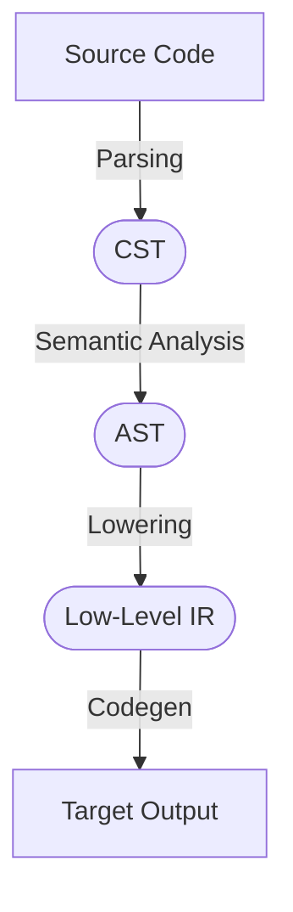
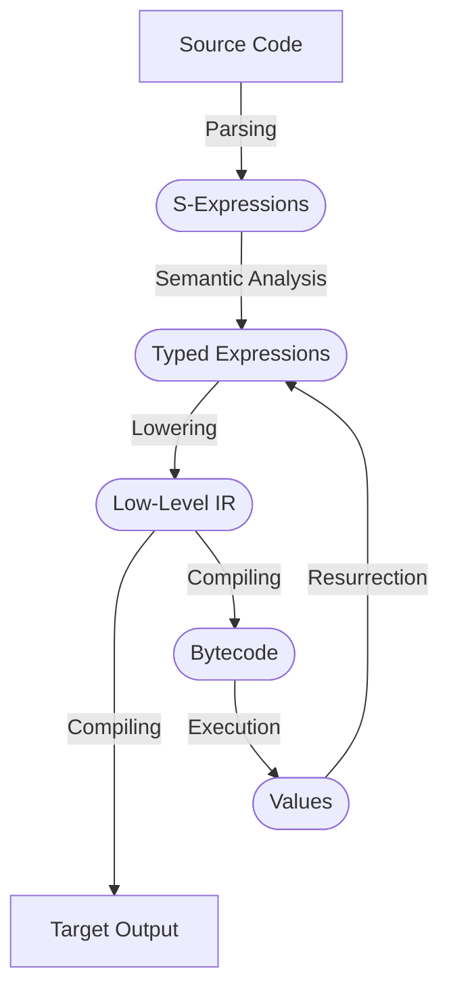

# $\color{almond}\textit{fluent}$

a language that is:
- as fast as C
- as typesafe as ML
- as metaprogrammable as Lisp

## installation

fluent is built with latest stable release of zig. once you have zig installed,
just clone this repo and `zig build`.

## get started

- the [working spec](spec.md) and [examples](examples/) are helpful for getting
  a rough idea of what fluent looks and feels like.
- try out `fluent repl`.

## what makes fluent unique?

a typical AOT compiler for a language like C is organized something like this:

fluent achieves its superpowers through the use of its novel compiler
architecture. instead of a linear compilation model, fluent code is lazily
executed as needed to semantically analyze source code.

this means that no expression in fluent is special. every piece of code
(including types) is available to be evaluated in the same language as the
statically compiled runtime.

this is what fluent's compiler looks like:

